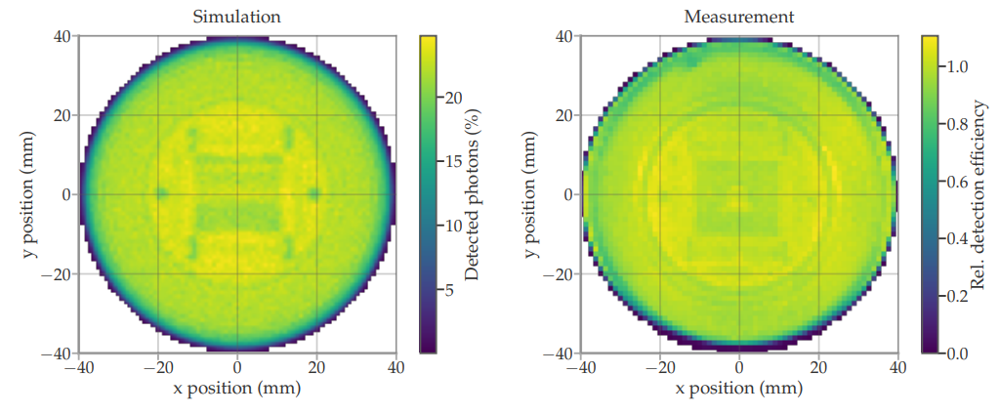

# Framework functionality
[TOC]

This framework offers tools to simplify geometry construction and material definitions, as well as a detailed PMT response mechanism. This page provides a brief introduction to the main features.

---

## Materials and User Data

User-defined material data are stored in JSON files under `/common/data` to avoid filling source code with numbers.
The `OMSimInputData` class (see `OMSimInputData.hh`) is responsible for processing these files and loading the material properties into the Geant4 framework. It uses the `OMSimMaterialHandler` class to handle the specifics of material creation and property setting.

### Material Handling

The `OMSimMaterialHandler` class is the core component for creating and modifying materials. It provides several key methods:

- `OMSimMaterialHandler::processMaterial`: Creates a new material or modifies an existing one based on the data in the input file.
- `OMSimMaterialHandler::processSurface`: Processes and returns an optical surface defined in the input file.
- `OMSimMaterialHandler::processExtraProperties`: Adds additional properties to an existing material.
- `OMSimMaterialHandler::processSpecial`: Handles special material types like IceCube ice or scintillators that require custom processing.

Materials created via this class can be retrieved using Geant4's conventional method `G4Material::GetMaterial`. The `OMSimInputData` class also provides a wrapper method `OMSimInputData::getMaterial` to handle default parameters and special "argument materials".

### Optical Surfaces

For optical surfaces, `OMSimInputData` provides the method `OMSimInputData::getOpticalSurface`, which doesn't exist in Geant4 by default.

### Special Material Types

Different materials may require different types of properties and processing. The `OMSimMaterialHandler` class can handle various material types, including:

- Standard materials with refractive index and absorption properties
- IceCube ice, where the optical properties are calculated by the selected depth (an arg variable)
- Scintillator materials with complex decay time and yield properties

Special processors for these materials are implemented in separate namespaces (e.g., `IceProcessor`, `ScintillationProcessor`) and can be passed to the `OMSimMaterialHandler::processSpecial` method.

### Geometry Data

PMT construction data is also stored in JSON files (`/common/data/PMTs`). This data is loaded into a "tree" (essentially a dictionary containing the JSON file's keys and values) in `OMSimInputData::m_table`. This approach allows for flexible PMT construction without defining a unique class for each PMT type.

### Adding New Data

To add new material data:

1. Create a new JSON file in the appropriate directory under `/common/data`.
2. If the material requires special processing, you may need to create a new processor function or namespace.
3. Update `OMSimInputData::processFile` to handle the new file type if necessary.

For simpler tasks, you can use the static method `Tools::loadtxt` provided by the [`Tools` namespace](md_extra_doc_2_technicalities.html#autotoc_md20).

---

## Geometry construction

Each optical module and harness is defined in its respective class, located in the `/common/geometry_construction/` folder. These inherit from the virtual base class `OMSimOpticalModule`. 

This inheritance ensures the definition of functions to retrieve the pressure vessel's weight (necessary for radioactive decay studies) and the count of PMTs inside the module. The `OMSimOpticalModule` interface inherits from `OMSimDetectorComponent`, a general helper class simplifying construction. Most OMSim geometries inherit from this class, as illustrated in the dependency diagram below:


The `OMSimPMTConstruction` class constructs PMTs. There are two PMT construction approaches. The first is simple, with a solid photocathode where all entering photons are recorded. This mode can be activated using the argument `--simple_PMT`. The second, default, approach simulates the photocathode as a thin layer, also representing the internal components accounting for internal reflections. For more information, refer to Chapter 9 of [this thesis](https://zenodo.org/record/8121321). 

In the complex PMT model, the photocathodes are not real volumes, but are defined as a boundary condition between the glass and internal vacuum. The original `G4OpBoundaryProcess` of Geant4 was modified in `OMSimOpBoundaryProcess.cc` in order to simulate the optical propierties of thin layers (see [Nicolai Krybus's thesis]()).

The construction of different PMT models (e.g. the 3'' or 10'' PMTs) is quite similar. However, the frontal window shape varies among models, leading to diverse combinations of ellipsoids and spheres.

<div style="width: 100%; text-align: center;">

<div style="width: 80%; margin: auto;">
<br/>
Figure 1: <i>Cross section of simple mDOM PMT model. Image from <a href="https://zenodo.org/record/8121321">M. Unland's thesis</a>.</i>
</div>

</div>
<div style="width: 100%; text-align: center;">

<div style="width: 80%; margin: auto;">
<br/>
Figure 2: <i>Side view of complex mDOM PMT model. Image from <a href="https://zenodo.org/record/8121321">M. Unland's thesis</a>.</i>
</div>
</div>

---

## Making PMTs and OMs sensitive

For photon detection in both simple and complex geometries, the photons must be absorbed within the photocathode. The photocathodes are made sensitive through the OMSimSensitiveDetector class, following Geant4's G4VSensitiveDetector pattern. This configuration is achieved by invoking `OMSimOpticalModule::configureSensitiveVolume` (or `OMSimPMTConstruction::configureSensitiveVolume` when simulating a single PMT). 

It is essential to invoke this method in the detector construction, as it needs the instance of `OMSimDetectorConstruction` to call `G4VUserDetectorConstruction::SetSensitiveDetector` for successful operation in Geant4 (refer to `OMSimDetectorConstruction::registerSensitiveDetector`).

> **Important**: Creating a new instance for each module to ensure that hits are correctly associated with their respective modules and prevents cross-talk between detectors.

Here's an example of how to properly create and configure sensitive detectors for multiple optical modules:

```cpp
for (int i = 0; i < numberOfModules; ++i) {
    mDOM* module = new mDOM(false);
    G4String nameExtension = "_" + std::to_string(i);
    module->placeIt(G4ThreeVector(0, 0, i*3*m), G4RotationMatrix(), m_worldLogical, nameExtension); //you have to have unique names
    module->configureSensitiveVolume(this);
}
```

Every step of a particle through the photocathode triggers the `OMSimSensitiveDetector::ProcessHits` method. It verifies if the particle is a photon and whether it was absorbed. For a deeper understanding of Geant4's philosophy concerning G4VSensitiveDetector, consult the [Geant4 guide for application developers](https://geant4-userdoc.web.cern.ch/UsersGuides/ForApplicationDeveloper/html/Detector/hit.html?highlight=g4vsensitivedetector#g4vsensitivedetector).


---


## Storing hits and PMT response

### PMTs Charge, transit time and detection probability 

In `OMSimPMTConstruction::configureSensitiveVolume`, PMTs are associated with an instance of `OMSimPMTResponse`, contingent on the PMT under simulation. This class offers a precise PMT simulation by sampling from real measurements, obtaining the relative transit time, charge (in PE), and detection probability (using the measured scans from [this thesis](https://zenodo.org/record/8121321)). For details, refer to Section 9.3.4 of the linked thesis.

This sampling is performed for every absorbed photon in `OMSimSensitiveDetector::ProcessHits` invoking `OMSimPMTResponse::processPhotocathodeHit`. The position of the photon on the photocathode is retrieved, the 2D-histograms of the gain, SPE resolution, transit time and TTS are interpolated for that position and the charge / transit time of the photon is sampled from a Gaussian using the interpolated values as mean (in case of gain / transit time) and standard deviation (in case of SPE resolution / TTS). 

<div style="width: 100%; text-align: center;">

<div style="width: 80%; margin: auto;">
<br/>
Figure 3: <i>PMT response compared to measurement for different light sources. Image from <a href="https://zenodo.org/record/8121321">M. Unland's thesis</a>.</i>
</div>
</div>

If you use the complex PMT model, you will obtain detection probability weights, which are the product of quantum efficiency (QE)—which varies with photon wavelength—and collection efficiency weight (which depends on absorption position). These weights are calibrated to match measurements. For more technical details, see the section [Matching PMT Efficiency to Measurements](md_extra_doc_2_technicalities.html#autotoc_md21).

In contrast, with the simple PMT model, the detection probability weight is solely the QE. Since the measured QE is reduced due to absorption in the PMT glass, the simulated tube glass will have no defined absorption length.

<div style="width: 100%; text-align: center;">

<div style="width: 80%; margin: auto;">
<br/>
Figure 4: <i>QE of simulation with the absorption length currently used compared to measurements. Image from <a href="https://zenodo.org/record/8121321"> this thesis</a>.</i>
</div>
</div>

<div style="width: 100%; text-align: center;">

<div style="width: 80%; margin: auto;">
<br/>
Figure 5: <i>Detection efficiency simulation (left) compared to measurement (right) using the calculated collection efficiency weights. Image from <a href="https://zenodo.org/record/8121321">M. Unland's thesis</a>.</i>
</div>
</div>


### Hit storage

The absorbed photon data is managed by the `OMSimHitManager` global instance. It maintains a vector of hit information (`HitStats` struct) for each sensitive detector. To analyze and export this data, use the `OMSimHitManager::getSingleThreadHitsOfModule` method to retrieve data for the current thread, or `OMSimHitManager::getMergedHitsOfModule` to obtain merged data from all threads. Note that `OMSimHitManager::getMergedHitsOfModule` works only if `OMSimHitManager::mergeThreadData` has been called (happens at the end of the run when `OMSimRunActio::EndOfRunAction` is called). For analysis or storage at the end of an event, handle each thread separately as events end asynchronously. For practical examples, refer to the methods in `OMSimEffectiveAreaAnalysis` and `OMSimSNAnalysis::writeDataFile`.

An additional feature allows for the direct application of a QE cut. This ensures that only absorbed photons passing the QE test are retained in `OMSimHitManager`. To enable this feature, provide the "efficiency_cut" argument via the command line. In this case `OMSimSensitiveDetector::ProcessHits` will call `OMSimSensitiveDetector::isPhotonDetected` and break early if it returns false, without storing the photon information. In most scenarios, it's not recommended to use --efficiency_cut since it reduces your statistics. It's generally better to perform post-analysis using the saved `OMSimPMTResponse::PMTPulse::detectionProbability` for each absorbed photon. In case that efficiency_cut is active and the photon is stored, its `OMSimPMTResponse::PMTPulse::detectionProbability` will change to 1, since it was detected.

---

## Making other volumes sensitive to photons

For some studies, you might want a volume to detect photons, without this necessarily being a PMT. For such cases, the framework has a provision in place: use the `OMSimSensitiveDetector` and pass `DetectorType::GeneralPhotonDetector` as its constructor argument.

In this case, the `OMSimSensitiveDetector::ProcessHits` will use an instance `NoResponse` as PMT response, which is just a dummy placeholder.  

Remember to inform the `OMSimHitManager` that this detector is equivalent to "a single PMT", ensuring internal vector sizes adjust accordingly.

This approach ensures a smooth integration of the photosensitive volume within the current system. Below is an example illustrating how this can be incorporated within the detector construction:

```cpp
#include "OMSimSensitiveDetector.hh"
//... Assume the logical volume of your detector has been defined and is referred to as "lDetectorLV"
OMSimSensitiveDetector* sensitiveDetector = new OMSimSensitiveDetector("myDetector", DetectorType::VolumePhotonDetector); 
OMSimHitManager &hitManager =  OMSimHitManager::getInstance();
hitManager.setNumberOfPMTs(1, hitManager.getNextDetectorIndex());
registerSensitiveDetector(lDetectorLV, sensitiveDetector);
```

In this case, `OMSimSensitiveDetector::ProcessHits` will store all absorbed photons. The number of photons absorbed will depend on the absorption length of the material connected to the logical volume. If you want it to be 100% efficient, use the material `RiAbs_Absorber`.

If there's a need to make a volume sensitive to particles other than photons, add a new entry to the `DetectorType` enum (in `OMSimSensitiveDetector.hh`) and incorporate a new method that handles this scenario in `OMSimSensitiveDetector::ProcessHits`. You might also track these particles in `OMSimTrackingAction` or `OMSimSteppingAction`, but using a class derived from `G4VSensitiveDetector` aligns with the philosophy of Geant4.
