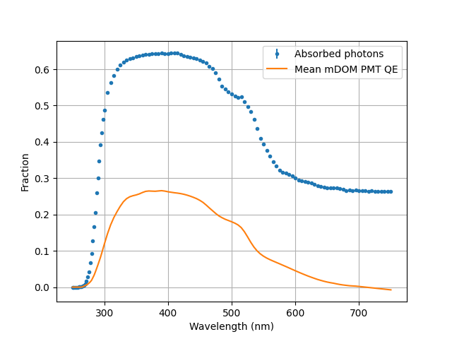
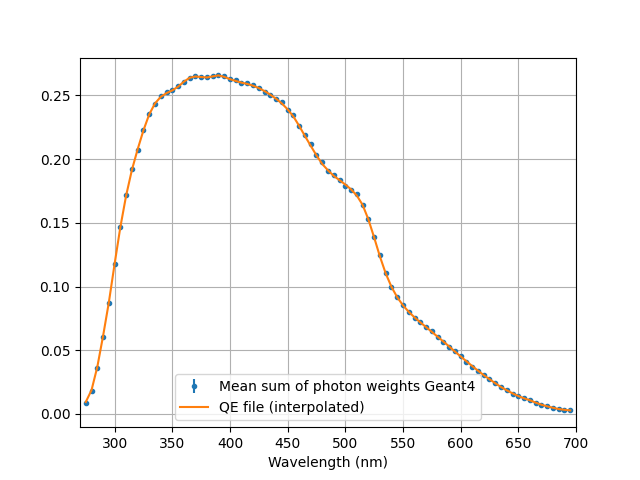

# Technicalities for Developers
[TOC]

## Visualization of Complex Objects

The complex shapes of PMTs and other intricate objects may not render correctly with the default OpenGL (OGL) visualization engine. To ensure the visualizer remains functional, these objects are set to invisible by default.

For a more detailed visualization that can handle complex geometries, you can use the RayTracer engine. While slower and more complex to use, RayTracer can visualize all volumes, regardless of their complexity. Here's how to set it up:

- **Enable RayTracer:**
   - Open `common/data/vis/init_vis.mac`
   - Comment out the line that loads `vis.mac`
   - Uncomment the line that loads `vis_raytracer.mac`

- **Make Objects Visible:**
   - Locate the visibility settings for the object you want to visualize
   - Change the condition that sets objects to invisible
   - Set the desired visibility attributes

   Example for PMT glass visibility:

   ```cpp
   // Original code
   if (m_internalReflections && OMSimCommandArgsTable::getInstance().get<bool>("visual"))
   {
       logicalPMT->SetVisAttributes(m_invisibleVis);
       // ... other invisible settings ...
   }
   else
   {
       logicalPMT->SetVisAttributes(m_glassVis);
       // ... other visible settings ...
   }

   // Modified code
   if (false) // This condition will never be true, ensuring objects are always visible
   {
       // ... invisible settings ...
   }
   else
   {
       logicalPMT->SetVisAttributes(m_glassVis);
       tubeVacuum->SetVisAttributes(m_airVis);
       vacuumBackLogical->SetVisAttributes(m_airVis);
       // ... other visible settings ...
   }
   ```

- **Customize RayTracer Settings:**
   - Open `common/data/vis/vis_raytracer.mac`
   - Adjust parameters such as:
     - Viewing angle
     - Lighting conditions
     - Resolution
     - Background color

## The Tools namespace
 
The tools namespace provide several methods that could help you. For example, `Tools::loadtxt`, `Tools::linspace` and `Tools::logspace` operate similarly to their Python's numpy counterparts:

```cpp
#include "OMSimTools.hh"
std::vector<G4PV2DDataVector> lData = Tools::loadtxt("path/file_name.txt", true);
std::vector<G4double> lFirstColumn = lData.at(0);
std::vector<G4double> lSecondColumn = lData.at(1);

std::vector<double> lWavelengths = Tools::linspace(275, 750, 96);
std::vector<double> lAbsLengths = Tools::logspace(-9, -4, 20);

std::vector<double> data = {1, 2, 2, 3, 3, 3, 4, 4, 5};
auto [counts, edges] = Tools::histogram(data, 5);

// ...
```

---
---

## Nomenclature

We follow these naming conventions:

Methods:
- Written in camelCase, starting with a lowercase letter
- Example: `calculateDistance()`
- Note: This contrasts with Geant4's methods, which always start with an uppercase letter

Classes:
- Written in PascalCase (also known as UpperCamelCase)
- Core framework classes should start with `OMSim`
- Example: `OMSimDetectorConstruction`

Namespaces
- Written in PascalCase
- Example: `ToolsNamespace`

Member Variables:
- Prefix: `m_`
- Written in camelCase after the prefix
- Example: `m_particleEnergy`

Global Variables:
- Prefix: `g_`
- Written in camelCase after the prefix
- Example: `g_worldVolume`

Function Parameters:
- Prefix: `p_`
- Written in camelCase after the prefix
- Example: `p_initialPosition`

Local Variables
- No prefix, written in camelCase
- Example: `localParticle`

By adhering to these conventions, we aim to:
1. Clearly distinguish OMSim code from Geant4 code (so we can for example find+replace code without worries)
2. Easily identify the scope and purpose of variables and functions
3. Maintain consistency throughout the codebase, enhancing readability and maintainability

Remember to apply these conventions consistently across all new code and when refactoring existing code.

---
---


## Matching PMT to Measurements

In order to simulate the PMT efficiency correctly, each photon is given a weight that corresponds to the detection probability ([click here](md_extra_doc_0_common.html#autotoc_md5) for more details). These weights are calculated using data files to match measurements. These data files have to be generated for each new PMT that is to be added to the framework. The module `efficiency_calibration` facilitates this procedure. In the following, the mDOM PMT is used as an example.

### Step 1: Fraction of absorbed photons

The optical properties (refractive index, thickness, and absorption length) of the glass tube and photocathode determine the number of photons absorbed in the photocathode. The optical properties of the photocathode (defined in file `Surf_Generic_Photocathode_20nm.dat`) are from this paper https://arxiv.org/abs/physics/0408075 .

To calculate the quantum efficiency weight, we have to know how many photons are absorbed in the photocathode in the simulation. For this, go through the following steps:
 - The most precise procedure is to simulate the beam used during the QE measurement (see for example `Beam::configureErlangenQESetup` and `Beam::runErlangenQEBeam` for the beam used in Erlangen). If you don't know the divergence / beam size of the setup, you may use the one from Erlangen first.
 - In `OMSim_efficiency_calibration.cc` change the method `runQEbeamSimulation()` to use the newly defined beam instead of `runErlangenQEBeam`. Define there also the wavelength range to be simulated.
 - Run the simulation with the following command, changing the PMT number to the one you want to simulate (make sure that your PMT is in the list in `OMSimPMTConstruction::selectPMT`, or hard code it in `OMSimEffCaliDetector.cc`)
```bash
./OMSim_efficiency_calibration --pmt_model 0 --simulation_step 1 -n 500000 --threads 4 --output_file step1 --detector_type 1
```
 - Check results and uncertainty. You want to determine the fraction pretty accurately, you may repeat the simulation at the UV region with higher statistics (change wavelength range in `runQEbeamSimulation()`).

To obtain the fraction I just run this python code:

```py
wvs, h,_ =np.loadtxt("step1.dat", unpack=1)
N=500000
err = np.sqrt(h) / N
h /= N

plt.figure()
plt.errorbar(wvs, h, fmt=".", yerr = err, label ="Absorbed photons")
plt.ylabel("Fraction")
plt.xlabel("Wavelength (nm)")
plt.grid()
plt.legend()
np.savetxt("mDOM_Hamamatsu_R15458_CT_intrinsic_QE.dat",
           np.array([wvs, h, err]).T,
           delimiter="\t", header="Wavelength(nm) \t QE \t error")
```
Here the results of the mDOM PMT including its mean QE as comparison:

<div style="width: 100%; text-align: center;">

<div style="width: 80%; margin: auto;">
<br/>
</div>
</div>

> **Note**: Ensure that the (interpolated) QE of the PMT you intend to use is always smaller than the obtained absorbed fraction. If this is not the case you will have to change the optical properties of the photocathode and/or the tube glass!

If everything looks good, save the file (in the example above `mDOM_Hamamatsu_R15458_CT_intrinsic_QE.dat`) in `common/data/PMTs/measurement_matching_data/QE/` and move to step 2.

### Step 2: Expand OMSimPMTResponse and Verify QE

Add the path to the created file in your PMT file under the key `jAbsorbedFractionFileName` and also a default QE file under the key `jDefaultQEFileName` (check  `pmt_Hamamatsu_R15458_CAT.dat` for guidance).

Now run the simulation again 
```bash
./OMSim_efficiency_calibration --pmt_model 0 --simulation_step 2 -n 100000 --threads 4 --output_file step2 --detector_type 1
```

and check that the weights are being calculated correctly

```py
wvs, h, w =np.loadtxt("step2.dat", unpack=1)
N=100000
err = np.sqrt(h)*w/N**2
h /= N
w /= N


plt.figure()
plt.errorbar(wvs, w, fmt=".", yerr = err, label ="Mean sum of photon weights Geant4")
plt.xlabel("Wavelength (nm)")
plt.grid()
plt.legend()
```

<div style="width: 100%; text-align: center;">

<div style="width: 80%; margin: auto;">
<br/>
</div>
</div>

### Step 3: Matching detection efficiency scan

The next step is to create the collection efficiency weights to match the relative detection efficiency scans. For this the scan measurement is replicated in the simulation, scanning the PMT in a XY grid. The output file of the simulation of this step is a histogram with the position of absorbed photons for each beam position.

 - As before, we have to simulate the beam used during the scan measurement (see for example `Beam::configureXYZScan_PicoQuantSetup` and `Beam::runBeamPicoQuantSetup` for the beam used in Münster)
 - In common/data/PMTs/measurement_matching_data/setup_stuff you will find the radius vs distance file from the measurement which you might need to adjust (e.g. newz = z[-1] - z + getDistancePMTCenterToTip() your PMT - getDistancePMTCenterToTip() mDOM PMT) - see mDOM PMT file for reference. Make sure to use this file in 'configureZCorrection_PicoQuant' under 'simulations/efficiency_calibration/src/OMSimBeam.cc'. Under 'Beam::runBeamPicoQuantSetup' change the minimal distance (if (z<4.8) { z = 4.8;}).
 - In in `runXYZfrontalScan()` of `OMSim_efficiency_calibration.cc` change the scan range (`grid` vector) and radius limit (`rLim`) according to the diameter of your PMT
 - Also adjust the binning of the output histogram in `OMSimEffiCaliAnalyisis::writeHitPositionHistogram`
 - You can check if the distance is correct by running the following command and including e.g. scanner->runBeamPicoQuantSetup(0, 0); in 'runXYZfrontalScan()'
 ```bash
./OMSim_efficiency_calibration --detector_type 1 --pmt_model 0 -v --simulation_step 3 --simple_PMT
/vis/scene/add/axes 0 0 0 30 mm #example
/run/beamOn 10
```
 - Run the XY grid simulation. 10000 photons per grid position should be enough, but you may increase / decrease statistics as you want
 ```bash
./OMSim_efficiency_calibration --pmt_model 0 --simulation_step 3 -n 10000 --threads 4 --output_file step3 --detector_type 1
```
 - Fit the weights using simulation data. The analysis done for the mDOM can be found in the notebook located in `documentation/notebooks/detection_efficiency_matching/`.

 - Save the weights in a file and store it in `common/data/PMTs/measurement_matching_data/CE_weight/`
 - Add to this file in the PMT data file under the key `jCEweightsFileName`.
 - Run the simulation again and check if the weights are correct.

 ### Step 4: Matching gain / transit time scans

The scan data of transit time / gain must be corrected before use, as the coordinates of the beam do not necessarily correspond to the primary spot on the photocathode that is illuminated, since air-glass boundary refracts the beam. 

 - As before, we have to simulate the beam used during the scan measurement. 
 - Change the profile vector and rLim in `runfrontalProfileScannNKT()` under `simulations/efficiency_calibration/OMSim_efficiency_calibration.cc`
 - Run the XY grid simulation **using the simple PMT**, check the function being used under step 4

```bash
./OMSim_efficiency_calibration --simple_PMT --pmt_model 0 --simulation_step 4 -n 100000 --threads 4 --output_file step4 --detector_type 1
```
 - Follow the analysis in the notebook `documentation/notebooks/scans_matching/` and save the created files in `common/data/PMTs/measurement_matching_data/scans/`.  Note that OMSim expects a naming convention for these files (see `OMSimPMTResponse::makeScansInterpolators`).
 - Add the vector with scanned wavelengths in PMT file with the key `jScannedWavelengths` and add the path with the newly created scan files under the key `jScanDataPath` (check  `pmt_Hamamatsu_R15458_CAT.dat` for guidance).
 - Run the simulation in step 5 (modify method before accordingly) to check the output with the newly introduced files

```bash
./OMSim_efficiency_calibration --pmt_model 0 --simulation_step 5 -n 10000 --threads 4 --output_file step5 --detector_type 1
```

If you need to add more parameters (for example low gain probability, which is also photocathode position dependent and yet to be implemented), you will have to add a new interpolator map and `OMSimPMTResponse::makeScansInterpolators` accordingly.

---
---


