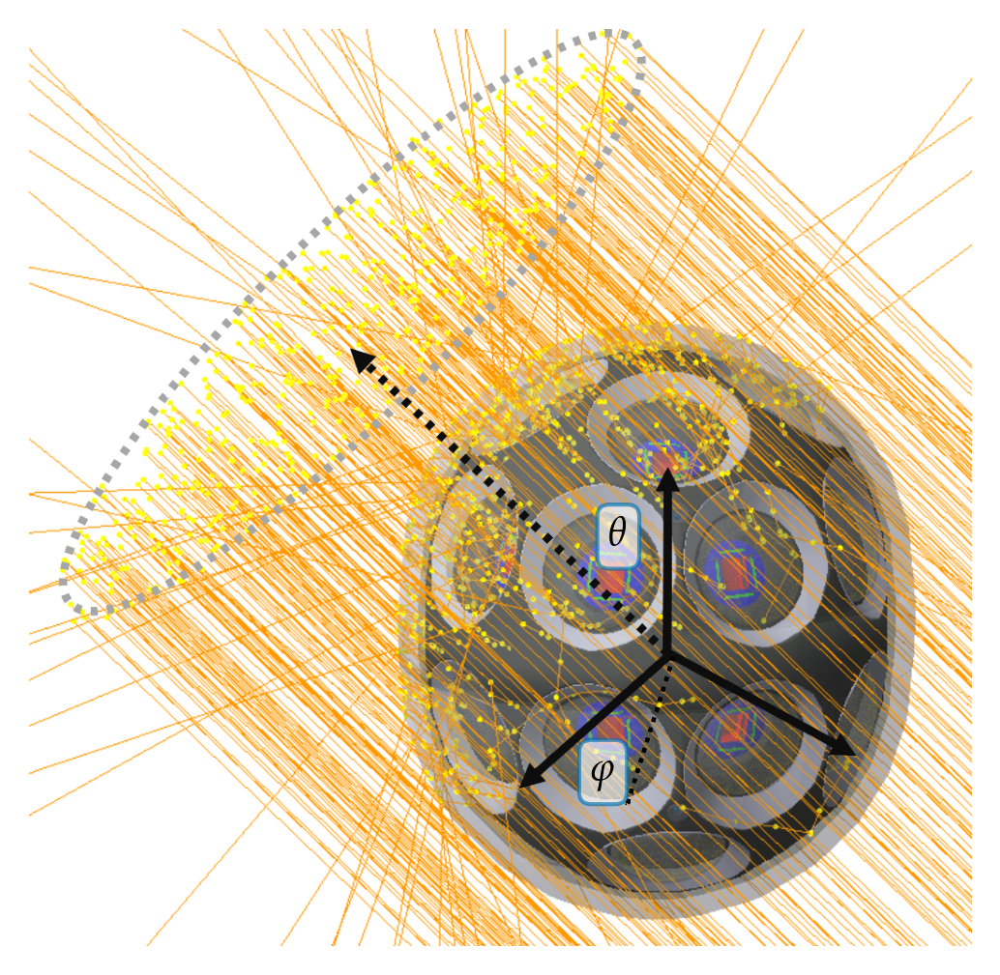

# > Effective Area Studies
[TOC]

In the folder `simulations/effective_area` you find the files pertinent to the effective area studies. 

## Introduction to effective areas
> **Note**: In the following, a short introduction of an effective area study is made with the mDOM as an example. For further details see Chapter 10 of [Lew Classen's thesis](https://www.uni-muenster.de/imperia/md/content/physik_kp/agkappes/abschlussarbeiten/doktorarbeiten/1702-phd_lclassen.pdf) or Section 9.3.5 of [Martin Unland's thesis](https://zenodo.org/record/8121321).

During the design of a module, its sensitivity is optimised by considering the optical properties of various materials and altering the geometry and positioning of the mechanical components in the Geant4 simulation.

The metric to optimise the module's sensitivity is the effective area A_eff(θ, φ). This represents the area that is detected from a plane wave of incidence angle of θ (zenith) and φ (azimuth) with respect to the module. This parameter is calculated with OMSim by simulating a disk emitting mono-energetic photons perpendicular to its surface with a uniform density profile.

The photon generation is made with the module `AngularScan`, running the method `AngularScan::runSingleAngularScan` once for each direction to be investigated.

<div style="width: 100%; text-align: center;">

<div style="width: 80%; margin: auto;">
<br/>
Figure 1: <i>Screenshot of an mDOM illuminated by a disk emitter simulating the incidence of a plane wave from the direction θ (zenith) and φ (azimuth) using the Geant4 visualiser. The photon trajectories are represented by orange lines, and yellow dots mark the locations of physical interactions. Image taken from <a href="https://zenodo.org/record/8121321">this thesis</a>.</i>
</div>
</div>

After simulating N photons from a plane of area A_rad (which has to be larger than the projected area of the mDOM), the effective area is calculated as

$$
A_{\mathrm{eff}}(\theta, \phi) = \frac{N_{\mathrm{det}}(\theta, \phi)}{N}\cdot A_{\mathrm{rad}},
$$

where N_det is the number of photons detected by the module. To optimise the sensitivity over multiple directions, A_eff(θ, φ) is calculated for various angle pairs, and the mean effective area, A_eff_mean, is determined. The n angle pairs are chosen using healpix, which separates a sphere into n pixels of equal area. Thus,

$$
\overline{A}_{\mathrm{eff}} = \frac{1}{n}\sum_{i=1}^n A_{\mathrm{eff}}(\theta_i, \phi_i).
$$

Since the effective area is wavelength dependent, the calculation must be repeated for different wavelengths. Wavelengths shorter than 300nm are absorbed by the pressure vessel, whereas the QE of the PMT approaches zero at wavelengths longer than 700nm.

## Example using healpy

In the following, an example of the usage of the effective area module is given. Although there are C++ healpix libraries, in my opinion, the easiest way of getting the angle pair coordinates is using Healpy in Python.

In principle, for short simulations, you could run the program directly from Python using the angles from healpy as input parameters:

```py
import healpy as hp
import numpy as np
from os import system

NSIDE = 8 #only powers of 2 allowed, the larger, the more pixels are calculated
NPIX = hp.nside2npix(NSIDE)
thetas, phis = np.degrees(hp.pix2ang(nside=NSIDE, ipix=np.arange(NPIX)))

for i, (theta, phi) in enumerate(zip(thetas, phis)):
    if i==0:
        system(f"./OMSim_effective_area -n 10000 --environment 1 -r 300 -t {theta} -f  {phi} --output_file output")
    else:
        system(f"./OMSim_effective_area -n 10000 --environment 1 -r 300 -t {theta} -f  {phi} --output_file output --no_header")
```

However, this is quite inefficient. The best is to save the angle pairs into a file and pass it as an argument. If you give a file as an argument, the arg theta and phi are ignored.

```py
import healpy as hp
import numpy as np
from os import system

NSIDE = 8 #only powers of 2 allowed, the larger, the more pixels are calculated
NPIX = hp.nside2npix(NSIDE)
thetas, phis = np.degrees(hp.pix2ang(nside=NSIDE, ipix=np.arange(NPIX)))
fname = "angle_pairs.txt"
np.savetxt(fname, np.column_stack((thetas, phis)))
system(f"./OMSim_effective_area -n 10000 --environment 1 -r 300 --angles_file {fname} --output_file output")
```

In my PC, the first code block needs 51 seconds (tested with NSIDE=2), the second block only 14 seconds (as simulation has to be initialised only once).
