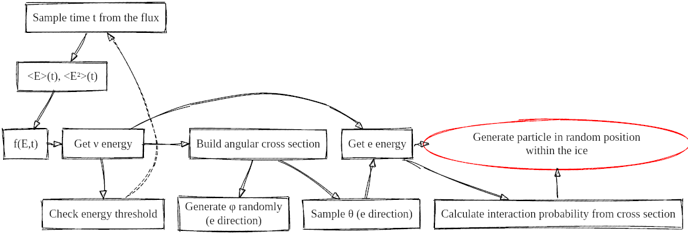

# > Supernova Studies
[TOC]

This module provides a comprehensive analysis and simulations focusing on the detection of CCSN neutrinos with segmented sensors.

This simulation is designed to emulate the detection of Core Collapse Supernova (CCSN or simply SN in the following) neutrinos using segmented sensors. It directly generates particles resulting from Inverse Beta Decay (IBD) and Electron Neutrino-Electron Elastic Scattering (ENES).

- IBD: `ν̄_e + p → n + e⁺`
- ENES: `ν_e + e⁻ → ν_e + e⁻`

In the IBD case, the outgoing neutron is not simulated; hence, the neutron capture process that might be detected is not included in the simulation. Each event is assigned a weight based on the interaction probability, detailed later on this page. By default, the surrounding ice is represented as a cylinder facing the CCSN, simplifying the weight calculations.

Although CCSN models incorporate neutrino oscillations, the default simulation does not include any oscillation scenario in the weight calculations.

<div style="width: 100%; text-align: center;">

<div style="width: 80%; margin: auto;">
<br/>
Figure 1: <i>Diagram of the steps involved to generate the events for the simulation of CCSN neutrinos. The scheme is valid for both IBD and ENES, except for the threshold check. Here, `e` stands for both electron from ENES or positron from IBD, and `ν` for both electronic neutrino from ENES or electronic antineutrino from IBD. Image from <a href="https://zenodo.org/record/8107177">this thesis</a>.</i>
</div>
</div>

The detailed procedure for this simulation is comprehensively described in 
[this thesis](https://zenodo.org/record/8107177), specifically in section 6.4. 
Below is a summary extracted from this source, outlining the steps taken to generate the events:

1. Utilizing the models, the expected flux per area is calculated from the luminosity 
`L(t)` and the mean energy `<E(t)>` according to `Φ(t) = (1 / (4πd²)) · (L(t) / <E(t)>)`.

2. The distribution of `Φ(t)` is used to sample a time `t` of the burst via 
the inverse CDF (Cumulative Distribution Function) method. All other sampling from distributions within this simulation 
also employs the inverse CDF method.

3. For the sampled time `t`, the corresponding mean energy and mean squared energy 
are extracted from the models. These parameters contribute to the construction of the 
energy spectrum `f(E,t)`, as elucidated in 
[this paper](https://arxiv.org/pdf/1211.3920.pdf).

4. The energy of the neutrino/antineutrino `E_ν` is sampled from `f(E,t)`. 
If the energy falls below the IBD threshold, the algorithm reverts to the second step.

5. From `E_ν`, the angular cross section is devised. This informs the sampling 
of the angle `θ` between the incoming neutrino and the resulting `e⁻/e⁺`. 
The `φ` direction is randomly generated within the range of `0` to `2π`.

6. The energy of `e⁻/e⁺` is deduced from `θ` and `E_ν`. The interaction 
probability for such an event is ascertained using the total cross section, 
facilitating the computation of the interaction weight, as further described below.

7. The `e⁻/e⁺` is manifested at a random position within the ice volume.

## Input Parameters

Execute `./OMSim_supernova --help` to display all possible input parameters.

A typical command to run the simulation is:

```
./OMSim_supernova -n 100 --wheight 20 --wradius 20 --depth_pos 75 --SNgun 0 --SNtype 0
```

### General Parameters
- `--depth_pos`: Index of the vector determining the depth of the simulated modules. Notable values include the dust layer (65), mean ice properties (approx) 75, and the cleanes ice (88). This selection affects the effective scattering and absorption lengths of the ice at the specified depth.
- `-o`: Output file name. By default, two output files are created: one containing the simulated event information, and another with detection data.

### SN Framework Parameters
- `--wheight`: Height of the ice's simulated world cylinder.
- `--wradius`: Radius of the ice's simulated world cylinder.
- `--SNgun`: Chooses the interaction type (0 for IBD, 1 for ENES).
- `--SNtype`: Selects the CCSN model. Two models are currently available, provided by the Garching group. These models represent the expected fluxes from two CCSNs resulting in neutron stars, with different progenitor masses (27 and 9.6 solar masses). Simulations yielding this data can be found at https://arxiv.org/abs/1510.04643

### Fixed Energy Studies
The user can also manually set the mean energy of generated events by providing specific input parameters. For instance:

```
--SNfixEnergy --SNmeanE 10.0 --SNalpha 3.0
```

- `--SNfixEnergy`: Acts as a flag parameter. When invoked, the simulation disregards the actual mean energy of neutrinos corresponding to the burst time. Instead, it adopts the mean energy and the pinching parameter specified by the subsequent two parameters.
- `--SNmeanE`: Specifies the mean energy of the neutrinos.
- `--SNalpha`: Defines the pinching parameter of the energy distribution (see [this paper](https://arxiv.org/pdf/1211.3920.pdf)).

Consequently, the neutrinos' energy is sampled from the distribution, derived from these two parameters and the previously mentioned model.

## Output Files

Two files are produced: 

### *_info.dat

This file encapsulates data concerning each generated neutrino event. Each entry contains:

- Time of the neutrino burst.
- Corresponding mean energy derived from the model.
- Sampled neutrino energy `E_ν`.
- `cos(θ)`, where `θ` is the angle between the incoming neutrino and the outgoing particle (e- or e+).
- Energy of the outgoing particle (e- or e+).
- Interaction weight, calculated using the formula:

  ```
  W_int(E_ν) = σ(E) · n_target · l,
  ```

  where:
  - `σ(E)` is the total cross section for the interaction,
  - `n_target` is the number of targets available for the interaction in the ice,
  - `l` is the length of the simulated cylindrical world.

### *_data.dat

This file contains the detection information. Its structure is designed to facilitate various trigger studies, allowing the examination of different time windows. Users might evaluate its structure for convenience, particularly if the trigger check is integrated within the simulation (requiring a predefined time window).

The default content structure is as follows:

```
Nr of sim. modules > Number of hits per module > for each PMT hit starting with module 0: { PMT number | Hit time | Det. probability }
```

Note that the number of columns varies per line, contingent on the number of photons detected for the simulated neutrinos.

## Weights

The output files contain the interaction weight. However, users should also consider a weight factor depending on the 
total flux and the number of simulated events. In the most general case of simulating a single depth and then 
extrapolating the results to the entire detector, another weight factor is needed. This factor accounts for the 
ice properties of the simulated depth with respect to the whole detector. This last factor decreases in importance 
when using high multiplicity conditions, since these events generally interact closer to the module, making the 
photons less sensitive to changes in the optical properties.

These weight factors can be added similarly as explained in 
[this thesis, section 6.4.2](https://zenodo.org/record/8107177).

The total weight is composed of 3 components: the interaction probability, the SN flux through the simulated volume, 
and the different optical properties of the modules at different depths:

```
W = W_int(E) · W_flux(d) · W_eff.
```

Each component is explained as follows:

### Interaction Probability Weight:
```
W_int(E_ν) = σ(E) · n_target · l,
```
where `σ(E_ν)` is the total cross section for the interaction, `n_target` is the 
number of targets per unit of volume for such interaction, and `l=40 m` is the length of the generation 
volume along the neutrino direction axis. This is the length of the cylinder facing the CCSN.

### Flux Weight:
```
W_flux(d) = (1 / N_gen) · (r² / d²) · ∫ (L(t) / <E(t)>) dt,
```
where `r` is the cylindrical generation volume's radius, `d` is the distance from Earth where the 
CCSN is assumed to occur, and `N_gen` is the number of generated events.

### Effective Weight:
```
W_eff = N_modules · (<V_eff(m)> / V_eff(m,z_sim)),
```
where `N_modules` is the total modules in the simulated detector, `V_eff(m, z_sim)` is the effective volume at the simulation depth, and `<V_eff(m)>` is 
the mean effective volume for all modules in simulated detector. The term `m` represents multiplicity, defined 
as the count of different PMTs within a single module that detected the event within a specific time window.

The effective volume can be calculated in different ways. Old simulations of the mDOM, described in 
[this thesis, section 6.3](https://zenodo.org/record/8107177), were used in past studies. A linear 
regression of the effective volume concerning the absorption length, derived from various depths, provides each 
depth's effective volume. Although it is advisable to redo these simulations with a current mDOM model, users can 
temporarily use the old data with a regression line of `V_eff = b · x + c`, where `x = 1/a` is 
the inverse of the absorption length. The coefficients `b` and `c`, depending on the event's multiplicity, were 
obtained as follows:

| Multiplicity | b (slope, m²) | c (m³) |
|--------------|---------------|--------|
| 1            | 15.1843       | 0.000  |
| 2            | 0.1352        | 47.005 |
| 3            | 0.0306        | 16.170 |
| 4            | 0.0095        | 8.680  |
| 5            | 0.0039        | 5.105  |
| >= 6         | 0.0026        | 2.909  |

Note that, for more than 5 PMTs, the same fit line is employed due to insufficient statistics at higher PMTs in the 
effective volume simulation. Additionally, since the absorption length depends on the wavelength, the fits above 
were obtained assuming a wavelength of `λ = 400 nm`.